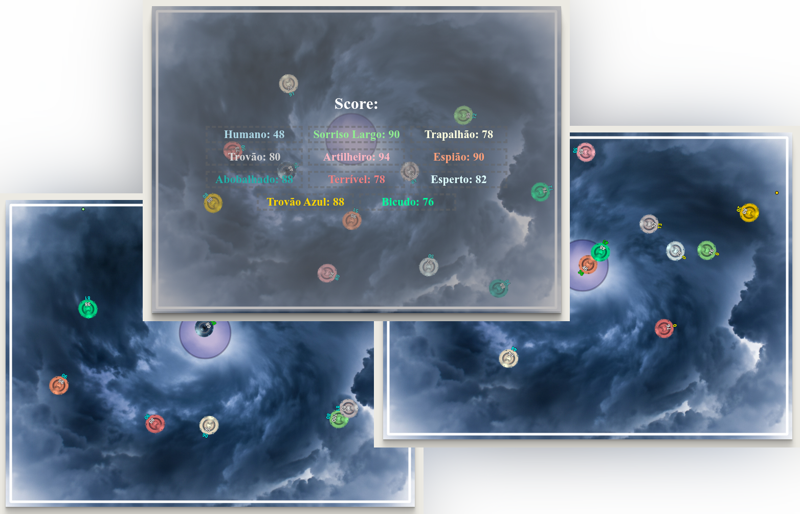
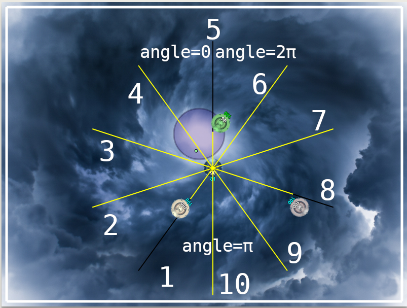

# Batalha de OVNIs

Este é um trabalho que desenvolvi para a disciplina de Inteligência Artificial que ministro, na UFES, campus de Alegre/ES.

<p align="center"></p>

Ele segue a linha de trabalhos em Prolog que tenho elaborado para meus alunos. Os primeiros trabalhos foram:
* [Corrida em Prolog](https://github.com/jeiks/corrida_em_prolog) - ([Online](https://www.jeiks.net/corrida_em_prolog/))
* [Batalha de Tanques](https://github.com/jeiks/batalha_tanques) - ([Online](https://www.jeiks.net/batalha_tanques/))
* [Batalha de Jatos](https://github.com/jeiks/prolog_jatos) - ([Online](https://www.jeiks.net/prolog_jatos/))

Você também pode jogar ele online em: [Jogar Online](https://www.jeiks.net/prolog_ovnis/)

O código inicial, ainda da corrida, foi baseado do projeto do Radu Mariescu-Istodor:
[Self-driding car - No libraries - JavaScript Course](https://www.youtube.com/watch?v=NkI9ia2cLhc)\
Atualmente, o código está bastante modificado. Mas, a inspiração inicial veio do trabalho dele.

O objetivo desse trabalho é controlar um Ovni utilizando um agente desenvolvido em Prolog para que ele seja o único sobrevivente. Estamos usando o [SWI-Prolog](https://www.swi-prolog.org/).
Além disso, costumamos fazer uma disputa em sala de aula, entre todos os agentes/trabalhos.

Regras do Jogo:
* Cada ovni pode se movimentar em qualquer direção;
* Cada ovni pode aumentar sua velocidade até um limite máximo;
* Cada ovni pode atirar só um tiro por segundo ou até acertar algo;
* Cada ovni começa com uma vida de 100 pontos e um escudo com energia 100;
* O escudo só funciona na parte de trás do ovni;
* O escudo degrada em 10 ao receber um tiro;
* O escudo não funciona se estiver na Oficina de Reparo (área azul na arena);
* Se encostar nas laterais do ambiente, perde 2 pontos de vida por segundo que estiver em contato/atrito;
* Se for atingido por um tiro fora do escudo, perde 10 pontos de vida.
* Se for atingido por um tiro na Oficina de Reparo, perde 10 pontos de vida.
* Os ovnis podem passar uns sobre os outros, pois estão em altitudes diferentes.
* A Oficina de Reparo conserta o escudo (mais rápido) e também restaura a vida do Ovni (mais devagar). Para isso, basta o ovni estar dentro de sua região.

Quando jogar pelo teclado, as teclas que deve usar são:
* Setas do teclado: movimentação do ovni.
* Espaço ou ENTER: atira\
  Obs.: só pode atirar uma bala por segundo.
* Tecla "s": exibe e esconde o placar (score) do jogo.

[http://jeiks.net/prolog_ovnis](https://www.jeiks.net/prolog_ovnis/)
 
### Instruções
Há várias formas de utilizar esse código, colocando:
* um ovni movido pelo teclado,
* nenhum ou vários ovnis movidos aleatoriamente por JavaScript,
* e nenhum ou vários ovnis sendo os agentes Prolog.

Para isso, edite as seguintes linhas do arquivo "main.js":

```js
dummyAgents = 10; // quantidade de agentes aleatórios (Java Script)
humanAgent = true; // modifique (true OU false) para ter um agente controlado pelo teclado ou não
prologAgents=["Ligerin", "ApagaFogo"]; // nomes e quantidade (tamanho do vetor) dos ovnis movidos pelo Prolog
```

Caso não tenham ovnis movidos pelo Prolog, deixe o vetor referente vazio ou comentado na área do usuário:
```js
//// --======-- Essa área pode ser configurada por você: --======--
...
prologAgents=[]; //se não quiser nenhum agente Prolog, faça assim ou só comente essa variável
```

Quando não há ovnis movidos pelo Prolog, você pode executar o arquivo ``index.html`` diretamente em um navegador de Internet (obs.: foi testado no [Brave Browser](https://brave.com/)).

Caso existam agentes ovnis movidos pelo Prolog, você tem que organizar o código em Prolog.\
Para isso, siga os passos abaixo.

### Como executar o servidor pelo Prolog

1. Instale o SWI-Prolog em seu GNU/Linux (derivado Debian) com: ``sudo apt install swi-prolog`` (ou baixe em [https://www.swi-prolog.org/](https://www.swi-prolog.org/))
2. Baixe esse repositório: ``git clone https://github.com/jeiks/prolog_ovnis``
3. Entre no diretório criado: ``cd prolog_ovnis``
4. E execute o comando: ``swipl -s servidor.pl`` (ou abra esse arquivo no swi-prolog)

Ele já inicia o servidor automaticamente e exibe a seguinte mensagem:
<pre>
   --========================================--

   % Started server at http://localhost:8080/


   --========================================--
</pre>

Agora então, é só ir ao navegador de Internet e acessar o endereço acima (http://localhost:8080/).

A implentação aqui está fornecendo dois ovnis que tem movimentos aleatórios.

O primeiro é implementado no arquivo ``agent1.pl`` e o seguindo no arquivo ``agent2.pl``.

Ao adicionar mais ovnis no ``main.js``, edite o arquivo ``agent_controls.pl``, adicionando:
```prolog
:- use_module(agent3, [obter_controles/2 as obter_controles3]).
```

Após isso, copie o arquivo ``agent1.pl`` para ``agent3.pl`` e altere seu cabeçalho do ``agent3.pl`` para:
```prolog
:- module(agent3, [obter_controles/2]).
```

onde ``agent3`` e ``obter_controles3`` se refere ao *Ovni* ***3***.

Siga esse exemplo para adicionar o Ovni 4 (``agent4``), o Ovni 5 (``agent5``), etc.

Para implementar a inteligência dos ovnis, edite e siga as intruções do arquivo ``agent1.pl``.

Have fun =)

### Informações adicionais

Para mostrar os sensores dos ovnis, modifique os valores das seguintes variáveis no arquivo ``main.js``:
```js
// Deixar os Sensores visíveis:
showSensors = true; //modifique (true OU false) para mostrar ou não os sensores dos agentes PROLOG e KEYS
showSensorsOfDummyAgents = true; //modifique (true OU false) para mostrar ou não os sensores dos agentes DUMMY
```

Além disso, os ovnis podem retornar mensagens ao cliente web. Elas podem ser apresentadas no console do navegador.
Para isso, preencha corretamente a variável ``MSG`` do script em Prolog do agente e descomente a linha ``35`` do ``controls.js``:
```js
console.log(msg);
``` 
Também existem mensagens de debug nas linhas ``36 e 37``, ``60``, ``90``.

E sobre os sensores, aqui estão seus números (posições do vetor) e também o valor do ângulo do ovni:


